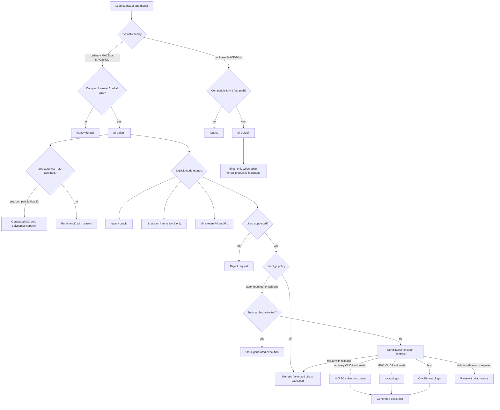
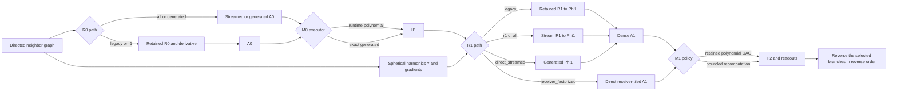
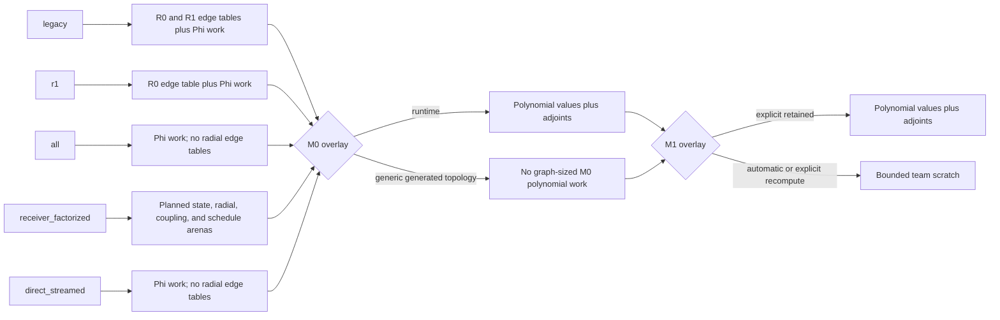
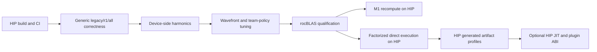

# Kokkos CUDA Execution Paths

Date: 2026-08-06

Committed tree: `86fdfc2` (`Merge branch 'field-aware' into direct-opt`)

Working-tree scope: this report also includes the pending structural
dynamic-channel R0-v2 artifact and selector changes visible in the current
worktree. Those changes are not part of `86fdfc2`; committed and pending
behavior are identified separately below. The report itself remains an
untracked local working-tree file; the cited evidence includes both committed
reports and local benchmark records.

## Executive summary

For compact format-v2 ordinary MACE and MACEField models, `all` is the generic
production default. It recomputes both radial networks inside their consumers
and removes the largest edge-sized R0/R1 tables. On compatible float32 models,
`all` also admits a checked-in structural AOT M0 program automatically, without
JIT compilation, and releases both graph-sized M0 polynomial tensors. `legacy`
remains the format-v1 and numerical-rollback path, while `r1` is an intermediate
diagnostic path that streams only the second interaction.

`direct` is an explicit optimized family, not a single kernel. It can use a
generic factorized receiver-state implementation, exact checked-in programs,
or a model-specific cached JIT artifact. R0, M0, R1 forward/reverse, and reverse
caching are admitted independently. Specialization is fail-closed by default:
`direct_jit="auto"` or `"required"` raises if an explicitly requested direct execution
specialization cannot be obtained; only `"fallback"` permits generic direct execution
after failure, and `"off"` selects generic direct execution directly.

Ordinary MACE and MACEField share the generated R1 boundary. Compatible
float32 CUDA MACEField models can also admit structural generated M0 and R0-v2;
the native field transform and analytic response remain outside those generated
edge kernels. Generic `all` and generic direct execution remain essential for unsupported
contracts, parameter gradients, observation, rollback, and precisions or
execution spaces not covered by a checked-in artifact.

On CUDA registry misses, ordinary R1 uses NVRTC by default to produce an exact-
SM cubin loaded and launched by the native evaluator on its Kokkos stream. The
retained `nvcc` shared-library compiler is the automatic fallback and explicit
rollback. MH-1 has an NVRTC implementation, but automatic mode still uses
`nvcc`; explicit NVRTC remains experimental pending broader isolated-process
qualification.

M1 polynomial recomputation is an independent portable storage policy. The
default `automatic` mode removes the two `[node, polynomial, channel]` M1 work
tensors when backend team scratch admits a 32-, 16-, or 8-channel tile. It
applies downstream of every A1 producer, including `all` and direct execution execution;
`retained` remains the explicit rollback and does not alter M0 selection.

## How Symmetrix operates

Symmetrix evaluates an exported interatomic model from atom types and a directed
neighbor graph. For every neighbor edge it combines a learned radial function
of the interatomic distance with spherical harmonics of the edge direction.
These edge contributions are accumulated at receiver atoms, transformed through
equivariant polynomial products and learned channel mixing, and finally mapped
to per-atom energies. Summing the per-atom values gives the total energy.

The evaluator then runs the same computation backward. Energy adjoints propagate
through the readouts, hidden states, polynomial products, neighbor aggregation,
radial functions, and spherical harmonics. Radial and angular coordinate
derivatives produce forces and stress; field-enabled models also propagate
electric-field response quantities.

`legacy`, `r1`, `all`, and direct execution therefore represent different execution plans
for the same mathematical model. They mainly decide whether large intermediate
tensors are retained, recomputed inside their consumers, factorized into bounded
receiver workspaces, or replaced by an exact generated kernel. Numerical
generic paths remain available through `all`, `direct_jit="off"`, or the explicit
`direct_jit="fallback"` policy when a specialized plan is not admissible.

## Quantity and index glossary

The short names follow the two-interaction MACE data flow. Broadly, `R` means
radial edge data, `A` means an atom-centered neighbor aggregation, `M` means a
many-body polynomial contraction, and `H` means a learned hidden state. The
suffix `0` or `1` identifies the first or second interaction stage; it is not a
derivative order.

| Quantity | Meaning in this implementation | Typical ownership and use |
|---|---|---|
| `H0_weights` | Learned element/type embedding: one channel vector for each source atom type | Model-sized constant data used when constructing the first interaction's radial/density contribution |
| `R0` | First-interaction radial functions evaluated for each directed edge, angular degree, and channel | In `legacy`/`r1`, an edge-sized tensor is materialized; `all` and direct execution evaluate the same functions inside A0 instead |
| `R0_deriv` | Derivative of `R0` with respect to scalar edge distance `r` | Used with `Y_grad` during reverse A0 to convert A0 adjoints into coordinate forces |
| `Y` | Real spherical harmonics of each directed edge direction | Supplies angular dependence to both interaction stages |
| `Y_grad` | Cartesian derivative of the spherical harmonics with respect to edge coordinates | Supplies the angular part of force and stress derivatives |
| `A0` | First atom-centered density. For each receiver, it sums neighbor contributions resembling `R0(edge,l,channel) * Y(edge,lm)` | Node-sized `[node, lm, channel]` tensor; input to the first many-body polynomial |
| `A0_scaled` | Optional environment/density-dependent rescaling of A0 | Changes A0 values before M0; some direct execution R0 executors fuse this scaling into generated density accumulation |
| `M0` | First many-body product basis. It evaluates configured products of A0 components and linearly combines the polynomial nodes | Node-sized equivariant features `[node, LM, channel]`; runtime execution retains the polynomial DAG, while admitted structural AOT M0 evaluates forward/reverse without those graph-sized tensors |
| `H1` | First hidden equivariant state derived from M0. In MACEField, the native field transform acts between the H1 product and linear-up stages | Node-sized equivariant state consumed by the second interaction and by the first energy readout |
| `R1` | Second-interaction radial functions, now associated with coupling paths and channels | `legacy` materializes edge values; `r1`, `all`, and direct execution re-evaluate or generate them inside the second interaction |
| `R1_deriv` | Distance derivative of `R1` | Radial part of the second-interaction coordinate reverse |
| `Phi1r` | Raw second-interaction receiver message before Clebsch-Gordan contraction. It sums `R1 * Y * H1(source)` over each receiver's neighbors | Node-sized path/coupling intermediate; the `r` suffix means raw/pre-CG here, not radial distance |
| `Phi1` | Clebsch-Gordan-coupled second-interaction message assembled from Phi1r | Node-sized `[node, coupled (l,m,path), channel]` input to dense A1 projection |
| `A1` | Second atom-centered equivariant density after applying learned A1 projection weights to Phi1 | Node-sized `[node, lm, channel]`; factorized direct execution produces it directly without materializing Phi1 |
| `M1` | Second many-body polynomial. It contracts products of A1 components into one scalar value per channel | Node-sized `[node, channel]`; its polynomial DAG is the target of the retained-versus-recompute storage policy |
| `H2` | Final scalar hidden state, combining a learned projection of scalar H1 components with a learned projection of M1 | Node-sized `[node, channel]` input to the nonlinear second readout |
| `node_energies` | Per-atom energy contributions from atomic reference energies and H1/H2 readouts | Summed for total energy; differentiated backward to obtain forces and stress |
| `node_forces` | Directed-edge coordinate derivatives accumulated by reverse A0/R1 and optional ZBL work | Reduced/assembled by the caller into atomic forces and stress according to the graph convention |

The main index names are:

| Index | Meaning |
|---|---|
| `node`, `i` | Receiver/central atom |
| `edge`, `ij` | Directed neighbor-list edge from receiver `i` to its source atom `j` |
| `lm` | Flattened spherical-harmonic component, conventionally `l*l + l + m` |
| `LM` | Flattened output equivariant component of a product basis; uppercase distinguishes it from an input harmonic component |
| `k`, `channel` | Learned feature channel, 128 in the recorded OMAT-medium runs |
| `path`, `eta` | Allowed angular-coupling path/multiplicity into a requested output degree |
| polynomial node `p` | Either an original A component or an intermediate product in the configured polynomial DAG |

Reverse-mode notation needs special care:

- `R0_deriv` and `R1_deriv` are analytic derivatives with respect to distance.
- `Y_grad` is an analytic Cartesian derivative of the angular basis.
- A suffix such as `A1_adj`, `M1_adj`, or `H1_adj` means the energy adjoint
  `dE/d(quantity)` propagated during reverse mode.
- `dPhi1` and `dPhi1r` are also energy adjoints, despite using a `d` prefix;
  they are not separately materialized coordinate-derivative tensors.
- `*_poly_values` stores forward polynomial DAG nodes; `*_poly_adjoints`
  stores the corresponding reverse DAG state. Recompute M1 reconstructs both
  temporarily in bounded team scratch.

In compact form, the ordinary forward calculation is:

`type embedding + R0 + Y -> A0 -> M0 -> H1`, then
`H1(source) + R1 + Y -> Phi1 -> A1 -> M1 -> H2 -> energy`.

The reverse calculation traverses this chain backward, producing energy
adjoints and combining radial and angular derivatives into forces and stress.

## Public mode selection

The four public names are defined once, but their implementations differ by
evaluator. Scalar CPU rejects `direct`. Nonlinear Kokkos uses a separate MH-1
contract and plugin ABI, described below.

## Ordinary MACE paths

| Path | Forward ownership | Reverse ownership | Main storage effect | Requirements and role |
|---|---|---|---|---|
| `legacy` | Materialize R0 and R1; build A0 and Phi1 from them | Consume retained derivatives | Retains edge-sized R0/R1 and node-sized Phi work | Works with format-v1 pair splines and compact models; numerical oracle and broadest compatibility |
| `r1` | Materialize R0; evaluate R1 splines while accumulating Phi1 | Re-evaluate R1 in streamed reverse | Removes R1 and R1-derivative capacity; retains R0 and Phi | Compact format-v2 only; isolates second-interaction streaming for diagnosis/rollback |
| `all` | Evaluate R0 inside A0 and R1 inside Phi1; automatically use structural AOT M0 when admitted | Re-evaluate both radial networks and use runtime or generated M0 reverse | Removes R0/R1 edge tables; admitted AOT M0 also removes M0 polynomial values/adjoints; retains Phi1/Phi1r and their adjoints | Compact format-v2; constructor default and JIT-free generic production path |
| `receiver_factorized` (direct execution algorithm) | Stream R0; factor radial/coupling state by receiver and produce A1 directly | Apply projection transpose once per receiver tile, then source/edge reverse | Avoids R0/R1 and Phi work; uses a bounded receiver workspace plus runtime projections | Distinct FP32 host RTC production path for ordinary MACE/MACEField; GPU adapters remain unimplemented |
| `direct_streamed` (generated production) | Generated R0/M0 when admitted; generated R1 produces Phi; dense A1 remains separate | Dense A1 transpose followed by generated coordinate reverse; MACEField then traverses native field stages | Avoids radial tables and generated M0 polynomial state, but currently retains Phi/dPhi around A1 | Exact JIT contract; supports ordinary MACE and MACEField, with precision/backend depending on artifact type |

### Shared evaluator sequence

All routes share H1/H2, readouts, force/stress accumulation, and most model
state. The useful comparisons are therefore at R0, M0, R1/A1, and M1 rather
than treating the evaluator as four unrelated implementations.

### CUDA kernel-level optimizations

**R0/A0.** `all` fuses compact radial evaluation into A0 accumulation. direct execution
adds generated R0 programs with `v1`, receiver-v2, edge16-v2, and edge32-v2
executors; `automatic` selects an admitted implementation. The v2 CUDA programs
fuse density scaling and use receiver/edge launch geometries encoded in the
artifact registry. The current uncommitted worktree additionally contains a
structural R0-v2 artifact admitted by structure fingerprint with runtime channel
count; it is not yet part of committed `HEAD` or the qualified benchmark tables.

**R1/Phi.** Generic streamed forward uses receiver/path teams and a warp-sized
vector range over channels. Generic CUDA reverse selects among a fused
edge-atomic kernel, an edge-owned kernel for bounded edge counts, and a
receiver-team fallback. These paths trade additional spline arithmetic for the
elimination of R1 global-memory traffic.

**Receiver-factorized R1.** Radial values are factored through a compact embedding,
couplings are processed in channel tiles, and dense projection work is reused
per receiver rather than per edge. A 64 MiB default planner budget chooses the
tile and whether each reverse group is retained or recomputed. Prepared-graph
tokens cache topology-derived schedules and permit evaluator-stream execution
without validation and allocation on every step.

**Direct-streamed R1 JIT.** Model weights and contraction structure are compiled
into exact forward/reverse programs from the runtime contract. The production
registry contains no exact R1 descriptors; fused JIT removes receiver-state
factorization and many general loops without limiting package builds to
published model architectures. Generated `receiver_factorized` remains the
feature fallback for observers and parameter gradients.

**M0.** Runtime M0 stores polynomial values and adjoints. The built-in standard
module evaluates the supported 422-term topology and its reverse directly,
eliminating those work tensors while reading channels, species, and weights at
runtime. M0 selection is independent of R0, R1, and M1. Other topologies retain
runtime M0 or reject an explicitly forced generated selector.

**M1.** `automatic` prefers recomputation and `retained` is the explicit
rollback. The evaluator selects the largest 32-, 16-, or 8-channel tile admitted
by CUDA shared memory, HIP LDS, or host team scratch. Serial/OpenMP and CUDA
support FP32/FP64; MACEField response scratch is included in admission. HIP
source support is implemented but remains unqualified without a complete ROCm
build and AMD hardware.

### Storage lifetime

The boxes are composable choices, not fixed bundles. For example, direct execution can
fall back to runtime M0 while retaining generated R1, and either can use
retained or recomputed M1.

## Exact-artifact admission and fallback

Generated R1 requires all of the following:

- explicit `direct` mode;
- compact-v2 model contract and verified model payload;
- an exact checked-in artifact or a successfully compiled and loaded host/CUDA
  artifact for the contract;
- a matching precision, backend, ABI, and execution profile;
- fixed learned parameters and the first-coordinate-reverse inference contract.

Forward and reverse capabilities are checked separately. Plugins add ABI
version, byte order, pointer width, artifact identity, semantic/contract
fingerprints, tensor extents, capability, GPU compute capability, and launch-
plan checks. A static registry miss proceeds to JIT under `auto`, `fallback`, or
`required`. Compilation or loading failure raises under `auto`/`required`; only
`fallback` then selects generic direct execution. Diagnostics and cache/artifact identity
remain available on the calculator.

MACEField can use `r1`, `all`, generic direct execution, and generated direct R1 execution. Compatible
float32 CUDA direct execution evaluations additionally admit structural M0 and R0-v2, and
compatible `all` evaluations admit structural M0 without invoking JIT. Field
conditioning, reverse field transforms, polarizability, Born effective charges,
and other analytic response work remain native stages around the generated
ordinary-model kernels. Generated tangent kernels are not provided; parameter
gradients, species gradients, double backward, and observation remain outside
the generated inference contract.

## Generated launch-profile policy

CUDA and HIP generated stages have a second, non-executable selection layer.
The registry-v4 resource selector chooses the most specific legal profile from
backend, architecture family/range, subgroup width, compiled geometry, and
device limits. The default calculator policy, `automatic`, never benchmarks:
it uses a pre-existing matching advisory record or immediately runs the
resource default. `static` bypasses record lookup and is the qualification
rollback. A record miss, corruption, stale identity, unsupported backend, or
native override rejection cannot invalidate the JIT artifact or stop an
otherwise supported calculation.

The explicit `symmetrix_calibrate_direct` command screens only registry-bounded
persistent blocks per SM/CU. It times a prepared graph, holds other groups at
their current winner, checks parity and repeated determinism, and requires an
improvement above both the configured threshold and measured noise. Executable
JIT artifacts and advisory tuning records use separate immutable cache trees.
`SYMMETRIX_LAUNCH_TUNING_CACHE` overrides the tuning root; record identities
separate heterogeneous GPU architectures and resource classes while allowing
equivalent nodes and power-of-two workload buckets to share results.

Publication is optimistic and race-safe: each calibrator uses a private
PID/UUID staging directory, fsyncs and validates the complete payload, and
publishes through an atomic no-replace operation. One result wins and all other
builders validate that winner. Per-stage diagnostics report profile/artifact
IDs, default and active multipliers, total persistent blocks, candidates,
selection source, and rejection reason. Calculator-level status and cache-key
fields identify `resource_default`, `calibrated`, `ignored`, or `static`
lifecycle states.

## Nonlinear MACE-MH-1 Kokkos paths

| Mode | Nonlinear meaning | Requirements |
|---|---|---|
| `legacy` | Retain each interaction's edge workspace | General nonlinear evaluator fallback |
| `r1` | Stream layer 1 only | Compatible MH-1 fast path |
| `all` | Stream every interaction layer; constructor default when supported | Compatible MH-1 fast path |
| `direct` | Factorable UVU edge tensor product, separate MH-1 schedules and source-owned reverse; optional v3/v4 host/CUDA plugins | Factorable convolution and final-linear weight layout, exact plugin contract for generated execution |

Nonlinear direct execution has its own scratch-budget planner, graph token, evaluator
stream, launch counters, and plugin ABI. It should not be inferred from ordinary
MACE R0/M0/R1 generated-artifact results. Scalar CPU supports `legacy`, `r1`,
and `all`, but explicitly rejects direct execution for both ordinary and nonlinear MACE.
Generated MH-1 ABI-v4 supports host and CUDA plugins, persistent node programs,
runtime parameter packs, and optional bounded compact-phi recomputation. CUDA
automatic JIT still selects `nvcc`; setting
`SYMMETRIX_JIT_CUDA_JIT_BACKEND=nvrtc` selects the implemented experimental
exact-SM cubin path.

## Build and runtime requirements

| Area | Requirement | Consequence |
|---|---|---|
| Toolchain | CMake >=3.27 for the Python package, C++20, Python development module, and a discoverable CUDA compiler for CUDA builds | Configuration fails if CUDA is requested but no compiler is found |
| Kokkos | `SYMMETRIX_KOKKOS=ON`; bundled Kokkos and Kokkos Kernels are used unless a Kokkos target already exists | CUDA is selected automatically when found and no host backend was explicitly selected |
| GPU target | A suitable `Kokkos_ARCH_*` target; the package defaults `Kokkos_ARCH_NATIVE=ON` | Generated launch profiles may impose a minimum compute capability |
| Harmonics | `SYMMETRIX_SPHERICART_CUDA=ON` for CUDA Sphericart | Both the Python package and embedded `libsymmetrix` builds default it ON whenever Kokkos CUDA is enabled; an explicit OFF remains a warned rollback control because it stages edge geometry and harmonics through the host |
| Dense algebra | BLAS plus Kokkos Kernels; CUDA builds use the enabled CUDA TPLs (including cuBLAS where configured) | Factorized direct execution uses batched/dense projection work on the evaluator stream |
| Model data | Compact format-v2 for ordinary MACE/MACEField `r1`, `all`, and direct execution; compatible nonlinear MH-1 uses format-v3 contracts; format-v1 ordinary models use `legacy` | Python warns when an old model prevents streamed execution; compatible raw ordinary-MACE checkpoints can be converted on load, while MACEField checkpoints require compact JSON |
| Precision | Generic evaluators, generic direct execution, ordinary R1 JIT, standard M0, and M1 recomputation support float32/float64. Generated MH-1 remains separately qualified | Capability admission selects a fitting tile or automatic retains M1; explicit recompute fails precisely |
| Runtime lifecycle | Call Kokkos initialization before constructing/evaluating and destroy evaluators before finalization | Finalization rejects live evaluator objects; device selection is mapped by Kokkos |
| Graph lifecycle | Standard calls accept directed neighbor arrays each evaluation; prepared direct execution calls require a valid graph-generation token | Stable topology avoids repeated validation, schedule construction, and allocation |
| Runtime specialization | Host plugins use a C++20 compiler. Ordinary CUDA R1 prefers NVRTC exact-SM cubins and can retry the retained nvcc shared-library backend; MH-1 automatic remains nvcc | CUDA cubins are loaded with the Driver API and launched on the Kokkos stream; built-in AOT and generic paths need no runtime compiler |
| Build size | M0/R0 AOT is architecture-generic; foundation R1 contracts use runtime JIT | Model names do not add package-time translation units |

The committed build partitions the standard Kokkos evaluator into six
translation units and the nonlinear evaluator into three. The partitions share
implementation templates under nonoverlapping compile-time guards. This
changes build scheduling and peak compilation pressure, not runtime backend
selection or numerical behavior.

`SYMMETRIX_STREAMED_STAGE_FENCES=1` is a diagnostic runtime switch that restores
per-stage fences. Normal admitted direct execution inference keeps stages on one evaluator
stream and performs a terminal completion fence; forced stage fences should not
be used for production timing.

## NVIDIA warp-32 portability

### Decision

Keeping a vector/warp width of 32 is correct for NVIDIA Ampere, Ada, and Hopper.
CUDA still defines a warp as 32 threads, and the device property used by direct execution
admission reports 32 on compute capabilities 8.0, 8.6, 8.9, and 9.0. This makes
the Kokkos `TeamPolicy(..., vector_length=32)` choices, generated 32-channel
tiles, and the MH-1 JIT's explicit lane calculation transferable across those
families.

That conclusion applies to **width and correctness**, not to a universal launch
optimum. NVIDIA's published SM resource limits differ substantially:

| NVIDIA target | Compute capability | Warp width | Maximum resident warps/SM | Maximum blocks/SM | Shared memory/SM (maximum per block) |
|---|---:|---:|---:|---:|---:|
| Ampere A100/A30 | 8.0 | 32 | 64 | 32 | 164 KB (163 KB) |
| Ampere 8.6 class | 8.6 | 32 | 48 | 16 | 100 KB (99 KB) |
| Ada | 8.9 | 32 | 48 | 24 | 100 KB (99 KB) |
| Hopper H100 | 9.0 | 32 | 64 | 32 | 228 KB (227 KB) |

Sources: [CUDA Best Practices Guide](https://docs.nvidia.com/cuda/cuda-c-best-practices-guide/index.html),
[Ampere Tuning Guide](https://docs.nvidia.com/cuda/ampere-tuning-guide/index.html),
[Ada Tuning Guide](https://docs.nvidia.com/cuda/ada-tuning-guide/index.html), and
[Hopper Tuning Guide](https://docs.nvidia.com/cuda/hopper-tuning-guide/index.html).
The limits are architectural maxima, not predicted Symmetrix occupancy.
Registers, shared memory, and compiler output can reduce residency further.

### What the source assumes

| Assumption | Cross-generation assessment |
|---|---|
| Kokkos vector length 32 and 32-channel ownership | Portable across Ampere/Ada/Hopper; it matches one NVIDIA warp and preserves the existing deterministic lane ownership |
| Raw MH-1 lane expressions such as `threadIdx.x & 31` | Correct on these targets; shuffle reductions use the synchronized CUDA intrinsics rather than relying only on implicit lockstep execution |
| Edge subgroups of 16 inside a warp | Correct: two logical 16-lane groups fit in every 32-lane NVIDIA warp; the generated shuffle width is explicitly 16 |
| 128- or 256-thread blocks | Legal on all targets, but occupancy and latency hiding must be measured per compute capability |
| Four persistent blocks per SM | A grid-size tuning target, not an admission proof or residency guarantee; resource use may prevent four simultaneous blocks and the scheduler will serialize excess blocks |
| M1 recompute tile 32 | Legal on all targets; its 36,352-byte reverse scratch allocation fits every listed per-block limit, but shared memory alone limits an 8.6/Ada SM to at most two such blocks |

The artifact registry currently records warp width 32, maximum block size 128
or 256, and in some profiles a four-block-per-SM grid target. All registered
CUDA profiles have minimum compute capability zero. Selection therefore admits
all four architecture classes by width, but does not express architecture-
specific occupancy or tuning evidence. This is acceptable for explicit
experimental artifacts, but it is not evidence that an RTX 5090-qualified
launch profile is optimal on A100, Ada, or H100.

### Build portability

The bundled Kokkos recognizes the required targets:

| Target build | Kokkos option |
|---|---|
| A100/A30 | `Kokkos_ARCH_AMPERE80=ON` |
| Ampere compute capability 8.6 | `Kokkos_ARCH_AMPERE86=ON` |
| Ada compute capability 8.9 | `Kokkos_ARCH_ADA89=ON` |
| H100 | `Kokkos_ARCH_HOPPER90=ON` |

The package currently defaults to `Kokkos_ARCH_NATIVE=ON`. Kokkos documents
that only one `Kokkos_ARCH_*` architecture can be active in this build mode, so
a binary built natively on the current Blackwell test host should not be treated
as the deployment binary for these older families. The conservative release
model is one wheel/library per compute capability, including separately compiled
CUDA plugins, with the architecture recorded in package metadata. See the
[Kokkos configuration guide](https://kokkos.org/kokkos-core-wiki/get-started/configuration-guide.html).

### Compiler and profiling requirements

Symmetrix currently has four distinct installation/runtime cases:

| Case | Compiler on the user machine | CUDA user-space libraries | NVIDIA driver | Nsight Systems/Compute |
|---|---|---|---|---|
| Install a prebuilt Symmetrix CUDA wheel and use generic or checked-in AOT paths | None | Must be bundled by the wheel or installed compatibly | Required | Not required |
| Build Symmetrix from a source distribution | C++20 compiler plus CMake; a CUDA build also needs a full compatible CUDA toolkit with `nvcc` and a supported host compiler | Supplied by the build environment/toolkit | Required for CUDA | Not required |
| Compile an ordinary CUDA R1 registry miss with NVRTC | None | Compatible NVRTC and CUDA runtime; `symmetrix-xl[cuda13]` supplies NVIDIA's CUDA 13 Python libraries | Required | Not required |
| Use the retained host or CUDA `nvcc` JIT | Host: C++20 compiler. CUDA: `nvcc`, its supported host compiler, toolkit headers/runtime, and POSIX dynamic loading | Compatible with the installed extension and generated plugin | Required for CUDA | Not required |

The Python build requirements automatically install `scikit-build-core`,
`pybind11`, and CMake. They do not install a system C++ compiler, NVIDIA driver,
or full CUDA development toolkit. The optional `cuda13` extra declares
`nvidia-cuda-nvrtc>=13,<14` and `nvidia-cuda-runtime>=13,<14`; CPU/OpenMP users
do not receive those dependencies. A prebuilt CUDA-major-compatible wheel can
therefore specialize ordinary R1 without `nvcc`, CUDA headers, a host compiler,
PyTorch, or upstream direct execution. The host always supplies the NVIDIA driver.

`SYMMETRIX_JIT_CUDA_JIT_BACKEND` accepts `automatic`, `nvrtc`, and `nvcc`.
For ordinary R1, `automatic` prefers NVRTC and retries `nvcc` after NVRTC
compile or module-load failure. Explicit `nvrtc` disables the compiler retry,
although generic fallback still follows `direct_jit`. For MH-1, `automatic`
currently selects `nvcc`; explicit `nvrtc` enables the implemented but not yet
promoted cubin path. The NVRTC loader probes
`SYMMETRIX_JIT_NVRTC_LIBRARY`, NVIDIA's Python package, then system library
names.

Nsight Systems and Nsight Compute are qualification/profiling tools, not runtime
dependencies. They should remain external developer/CI tools. Nsight Systems is
distributed through NVIDIA's `.deb`, `.rpm`, `.run`, CUDA Toolkit, or standalone
CLI packages rather than as a normal Python dependency. See the
[CUDA Linux installation guide](https://docs.nvidia.com/cuda/cuda-installation-guide-linux/#pip-wheels)
and [Nsight Systems installation guide](https://docs.nvidia.com/nsight-systems/InstallationGuide/index.html).

### cuequivariance comparison

As of cuequivariance 0.11.0, NVIDIA separates its portable Python frontends from
CUDA-major-specific binary operation packages. Users explicitly install
`cuequivariance-ops-torch-cu12` or `-cu13` (and equivalent JAX packages). The
CUDA 12 core wheel is about 33 MB compressed and contains a roughly 106 MB
uncompressed `libcue_ops.so`, framework bindings, CUDA headers, Triton kernels,
and tuning-cache records for compute capabilities including 8.0, 8.6, 8.9, and
9.0. Its binary links to `libnvrtc.so.12`, the CUDA driver, and cuBLAS. It loads
the prebuilt host library and uses NVRTC/Triton for runtime device compilation;
it does not shell out to a system `nvcc`.

This is why cuequivariance can offer a pip-centered installation while retaining
runtime specialization. NVRTC is a user-space compiler library and can be
provided by a CUDA framework installation or a pip CUDA runtime package. The
kernel-mode NVIDIA driver remains a host prerequisite. cuequivariance also does
not choose CUDA 12 versus CUDA 13 automatically: the user selects the suffixed
operations package. Its CUDA 12 core ops metadata declares cuBLAS but not NVRTC,
and its Torch binding does not install Torch, so the documented multi-package
installation still expects the selected framework/CUDA environment to provide
those pieces. See the official
[cuequivariance installation instructions](https://docs.nvidia.com/cuda/cuequivariance/)
and [CUDA 12 operations package](https://pypi.org/project/cuequivariance-ops-cu12/).

Symmetrix now implements the same broad deployment split for ordinary R1: the
wheel contains the native host loader, generated device-only source is compiled
to an exact-SM cubin with NVRTC, and the Driver API resolves and launches the
validated functions on the Kokkos stream. The retained `nvcc` plugin compiler
remains an explicit rollback and automatic ordinary-R1 retry. The recommended
distribution is therefore:

1. Compiler-free, CUDA-major-specific wheels for normal inference, selected
   explicitly by the user rather than inferred by pip.
2. A prebuilt generic path and checked-in AOT artifacts as rollback coverage.
3. NVRTC device specialization through a CUDA-major companion extra, with
   `nvcc` retained for development and rollback.
4. Full `nvcc`, host compilers, and Nsight tools only in developer/build images,
   not in the end-user Python dependency graph.

### Qualification matrix

Before calling a generated profile supported on a family, test at least one GPU
from each distinct compute capability: 8.0, 8.6, 8.9, and 9.0. For each build,
verify exact artifact admission/fallback, retained-versus-generated energy,
forces and stress, deterministic repeats, launch counts, register count, local-
memory spills, achieved occupancy, and end-to-end timing. Re-screen M1 tiles
8/16/32 and any persistent block multiplier rather than changing the warp width.

In short: retain 32 as the NVIDIA execution width, but make architecture target
and launch qualification explicit. No source change is needed merely to run on
Ampere, Ada, or Hopper; separate builds and cross-generation performance tests
are still required.

## Kokkos boundary and HIP/ROCm migration

### Are the CUDA paths inside Kokkos?

Partly. The ordinary evaluator is predominantly expressed with portable Kokkos
constructs: `Kokkos::View`, `RangePolicy`, `TeamPolicy`, `TeamVectorRange`,
scratch views, reductions, atomics, and `KokkosBlas`/`KokkosBatched`. Most of
`legacy`, `r1`, and `all` therefore has a realistic HIP porting path. Several
CUDA-optimized layers are nevertheless backend-specific:

| Component | Kokkos-portable core? | CUDA-specific dependency |
|---|---|---|
| Generic R0/R1, A0/A1, M0/M1, H1/H2 | Yes | CUDA-only branches select tuned kernel shapes; HIP would initially use generic branches |
| Generic streamed Phi1 forward/reverse | Yes | Fast reverse variants are guarded by `KOKKOS_ENABLE_CUDA`; many team/vector lengths are tuned around 32-thread warps |
| M1 recomputation | Yes | Backend capability admission queries CUDA shared memory, HIP LDS, or host team scratch; host uses vector length 1 and GPUs use the selected 32/16/8 tile |
| Factorized direct R1 execution | Mostly Kokkos | Fast batched projection calls cuBLAS directly and binds a `cudaStream_t`; the fallback issues KokkosBlas GEMMs per receiver |
| Built-in standard R0/M0 | Generated bodies use Kokkos launches | Runtime-shaped host/CUDA/HIP profiles are independent of exact model IDs; runtime R0/M0 remain topology fallbacks |
| Spherical harmonics | Kokkos manages surrounding views and normalization | Fast device calculation uses Sphericart CUDA and a raw CUDA stream; without it, data is copied to the host for CPU Sphericart |
| Ordinary direct execution plugin/JIT | No | NVRTC, CUDA Driver module loading/launch, the retained CUDA-runtime/nvcc plugin ABI, device properties, and generated CUDA kernels |
| Nonlinear MH-1 plugin/JIT | No | NVRTC or retained nvcc generation, Driver/runtime launch paths, CUDA stream ABI, and CUDA-specific v3/v4 contracts |
| Timing and diagnostics | Partly | CUDA events, driver/runtime queries, device guards, and compute-capability reporting |

Thus “Kokkos CUDA” describes the main memory and launch framework, not a rule
that every optimized operation is backend-neutral. The exact generated plugin
paths are intentionally native CUDA extensions around the Kokkos evaluator.

### Migration difficulty

The repository's bundled Kokkos 5.0.2 already supports `Kokkos_ENABLE_HIP`, and
the bundled Kokkos Kernels exposes a rocBLAS TPL. The dependency foundation is
there, but Symmetrix's top-level configuration only auto-detects CUDA/OpenMP and
contains no HIP-specific feature selection or CI. Migration difficulty depends
on the target:

| Target | Difficulty | Work required |
|---|---|---|
| Compile and validate generic `legacy`/`r1`/`all` on HIP | Moderate | Add explicit HIP/ROCm CMake handling, compile with a supported AMD architecture, keep CUDA features disabled, fix backend assumptions exposed by compilation, and run full energy/force/stress parity tests |
| Make generic `all` performant on AMD GPUs | Moderate to high | Add a device-side HIP-capable harmonic implementation, enable/qualify rocBLAS, replace CUDA-only fast-branch guards with execution-space traits, and retune team/vector sizes for the target wavefront and occupancy |
| Qualify M1 recomputation on HIP hardware | Low implementation risk, hardware required | Capability code supports wave32/wave64 HIP and FP32/FP64; complete build and runtime parity/performance on real AMD devices |
| Port factorized direct execution | Moderate to high | Add HIP execution-environment metadata and stream handling, provide rocBLAS strided-batched operations, retune receiver/channel tiles and reverse ownership, and qualify prepared-graph ordering |
| Port built-in generated direct execution artifacts | High | Extend generators and registry with HIP profiles, admit `Kokkos::HIP`, define AMD architecture/wavefront contracts, regenerate artifacts, and requalify numerical order, register pressure, spills, and occupancy |
| Port CUDA JIT/plugins and nonlinear MH-1 generated execution | High | Design a HIP plugin ABI and code generator, replace CUDA runtime/launch code, compile generated code with HIP, and establish ROCm lifecycle and compatibility tests |

A functional generic HIP backend is therefore not a rewrite, but it is not a
one-line Kokkos backend switch either. Competitive parity for `all` is a
contained portability project. Full parity with fixed-weight direct execution and nonlinear
MH-1 is substantially harder because those paths deliberately encode CUDA
execution contracts.

### Recommended migration sequence

The first production milestone should be a correct and competitive `all` path,
not immediate generated-direct execution parity. This preserves broad model coverage and
provides the numerical/performance oracle needed to qualify later HIP-specific
artifacts. No ROCm toolchain or AMD GPU was available for this audit, so this is
a static source assessment rather than a demonstrated HIP build.

## Performance and capacity evidence

These are repository benchmark records, not a new cross-device run. Compare
numbers only within a row because checkpoints used frozen binaries and models.
All rows below used an RTX 5090 and CUDA float32.

| Qualified comparison | Control | Optimized path | Result |
|---|---:|---:|---|
| Ordinary `all`, 864 atoms | retained M0: 10.871 ms / 1,616 MiB | AOT M0: 8.653 ms / 1,060 MiB | 20.4% faster; saves 556 MiB |
| Ordinary `all`, 32,000 atoms | retained M0: OOM | AOT M0 + M1 recompute: 264.641 ms / 7,630 MiB | Completes with all M0/M1 polynomial capacities zero |
| MACEField `all`, 864 atoms | retained M0: 10.247 ms / 1,602 MiB | AOT M0: 8.651 ms / 1,046 MiB | 15.6% faster; saves 556 MiB |
| MACEField direct execution, 864 atoms | runtime M0/R0-v1: 6.997 ms | generated M0/R0-v2: 5.176 ms | 26.0% faster |
| MACEField direct execution, 32,000 atoms | runtime M0/R0-v1: 226.855 ms | generated M0/R0-v2: 171.345 ms | 24.5% faster |
| MACEField R1 JIT, 32,000 atoms | `nvcc`: 179.2990 ms | NVRTC: 179.2944 ms | -0.003%; identical memory and outputs |
| Ordinary R1 JIT, n31 with M1 recompute | `nvcc`: 665.556 ms | NVRTC: 665.791 ms | +0.035%; both 16,290 MiB and bit-identical |

For generic `all`, AOT M0 is 11.1-20.4% faster than retained M0 across the
controlled size series. M1 recomputation is within +0.42% of AOT M0 alone and
removes a further 4,440 MiB at 32,000 atoms. Combined `all` reaches n30
(108,000 atoms) in 904.374 ms at 23,912 MiB, then n31 fails on residual generic
Phi storage. The earlier n31 completion at 16,290 MiB uses generated direct execution plus
M1 recomputation and is not an `all` capacity result.

The NVRTC migration is performance-neutral in steady state while reducing cold
compiler time. At the n31 follow-up, the bounded compiler portion was about
27 ms for NVRTC versus 822 ms for `nvcc`. MH-1 position-matched results were
also neutral, but automatic MH-1 promotion remains held until its broader
fresh-process qualification is complete.

## Recommended roles

| Path | Keep? | Recommended role |
|---|---|---|
| `legacy` | Yes | Format-v1 compatibility and strongest numerical rollback |
| `r1` | Yes | Incremental fault isolation and R1 streaming qualification |
| `all` | Yes, default | Generic compact-model production path and generated-path oracle |
| `receiver_factorized` | Explicit experimental production mode | direct execution receiver-factorized host RTC; faster than legacy materialization on the 864-atom MH-0 control but substantially slower than `direct` |
| `direct_streamed` | Yes, generated production | Highest-performance exact-contract inference when JIT admission passes |
| M1 recompute | Yes, automatic with retained rollback | Portable capacity policy; Serial/OpenMP and CUDA FP32/FP64 are hardware-tested, while HIP remains unqualified without a complete ROCm build and AMD device |

Removing the generic receiver control or `all` would turn an exact optimization into a
hard model/backend restriction. A future removal decision should require broad
generated coverage, field and parameter-gradient support, deterministic
fallback replacement, and same-build performance wins across supported GPUs.
Current evidence supports keeping `all` as default. Structural AOT M0 is
automatically admitted inside `all` because it is JIT-free and has an explicit
runtime rollback; generated R0/R1 specialization remains inside explicitly
selected direct execution mode.

## Source map

- Public calculator modes and JIT policy: `symmetrix/source/symmetrix/calculator.py`
- Public mode parser: `libsymmetrix/source/mace_streamed_edges.hpp`
- Ordinary MACE admission, mode transitions, forward/reverse, and policies:
  `libsymmetrix/source/mace_kokkos_runtime.cpp`,
  `libsymmetrix/source/mace_kokkos_evaluate.cpp`, and the semantic owners in
  `docs/mace_kokkos_source_layout.md`
- MACEField analytic response: `libsymmetrix/source/mace_kokkos_response.tpp`
- Generated artifact registry:
  `libsymmetrix/source/generated/direct_artifact_registry.hpp`
- CUDA plugin and Driver launch paths: `libsymmetrix/source/direct_cuda_plugin.cpp`
- NVRTC runtime loader/compiler: `libsymmetrix/source/direct_nvrtc.cpp`
- Nonlinear MH-1 execution: `libsymmetrix/source/mace_nonlinear_kokkos_impl.tpp`
- Nonlinear CUDA plugin: `libsymmetrix/source/direct_mh1_cuda_plugin.cpp`
- CUDA/backend build selection: `symmetrix/CMakeLists.txt`
- Library dependencies and AOT option: `libsymmetrix/CMakeLists.txt`
- CUDA runtime extras: `symmetrix/pyproject.toml`
- Backend contract and support matrix: `docs/direct_backend.md`
- JIT-free AOT M0/M1 record: `benchmarks/all_aot_m0_m1.md`
- MACEField generated M0/R0-v2 record:
  `benchmarks/macefield_mh0_generated_benchmark.md`
- NVRTC qualification: `benchmarks/direct_nvrtc_migration.md`
- MACEField standard/field scale comparison:
  `benchmarks/macefield_standard_aln_scale.md`
