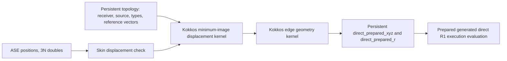

# MACE-OMAT-0 MD overhead profile and optimization

## Conclusion

The original ASE MD path hid the generated direct execution evaluator's advantage behind
repeated graph-boundary work. Reusing a deterministic skin topology and direct execution
schedule, reducing atom forces on the device, constructing retained-topology
geometry in persistent Kokkos views, and caching topology-derived type arrays
reduced the uninstrumented 2048-atom step from 36.619 to 7.951 us/atom. The
optimized 20-step trajectory remains qualified against PyTorch+cuEquivariance
and is 4.095x faster at the complete ASE VelocityVerlet step boundary.

LAMMPS had the same repeated topology/schedule issue and a second build-time
CUDA SpheriCart regression. Its optimized one-rank `direct` path retains the
LAMMPS Verlet topology until `neighbor->ago == 0` and only updates edge geometry
between neighbor rebuilds. Enabling CUDA SpheriCart removes another 62.0 MB of
host/device harmonic staging per evaluation. The corrected path measures 7.571
us/atom, 4.8% faster than ASE and 4.4% faster than corrected `streamed_edges=all`.
Nsight Systems attributes 99.1% of the LAMMPS step to GPU kernels.

The original ASE `streamed_edges=all` path measured 15.433 us/atom because it
reconstructed exact-cutoff graph arrays on the host every evaluation. Retaining
the skin candidates, updating geometry on device, and compacting the current
exact graph into persistent Kokkos views reduces its three-trial median to
7.955 us/atom, a 48.5% reduction. It now matches ASE direct execution within 0.05% and
LAMMPS `all` within 0.42% while preserving exact changing cutoff membership.

## Workload and measurement boundary

- NVIDIA GeForce RTX 5090, idle before every benchmark process launch
- MACE-OMAT-0 medium, float32, 2048-atom wurtzite AlN
- generated `streamed_edges="direct"` comparator artifact
  `jit-r1-f32-5a92711776c5960f`; `streamed_edges="all"` has JIT disabled
- initially empty private direct execution registry with mode `0700`
- deterministic 300 K Maxwell-Boltzmann/Gaussian velocities
- VelocityVerlet NVE, 1 fs timestep, 20 measured steps
- one untimed initial force evaluation before the measured trajectory
- primary metric: median microseconds per atom per MD step

The diagnostic ASE phase profiler synchronizes CUDA at every attribution
boundary, so its samples are additive but include fence overhead. The corrected
production-boundary profile instead synchronizes only complete MD steps and
uses NVTX/CUDA launch correlation to project GPU work into each step. The final
trace measured 16.458 ms/step, within 1.1% of the independent 16.284 ms
equivalence run, making the compute/noncompute attribution representative.
LAMMPS reports the complete
`run 20` loop time, including force evaluation, integration, neighbor
checks/rebuilds, and communication.

## ASE root cause

The original synchronized phase profile measured 73.50 ms/step
(35.89 us/atom):

| Phase | Original ms/step | Share | Prepared static timing? |
| --- | ---: | ---: | --- |
| Neighbor list and input construction | 32.58 | 44.3% | No |
| direct execution graph/schedule preparation | 9.19 | 12.5% | No |
| Native direct execution evaluation | 14.41 | 19.6% | Yes |
| Compute-wrapper/other overhead | 2.54 | 3.5% | No |
| Result collection and pair-force reduction | 14.39 | 19.6% | No |
| VelocityVerlet remainder | 0.39 | 0.5% | No |
| **Complete MD step** | **73.50** | **100%** | Primary boundary |

All three probed steps contained the same canonical 186,368 directed edges,
but ASE returned them in a different order each time. The ordered topology
hash and direct execution graph generation therefore changed on every step even though
the physical graph was unchanged. The original result path also copied every
pair force to the host, performed six NumPy `bincount` reductions, and formed
stress even when VelocityVerlet requested only energy and forces.

Prepared static evaluation measured 4.813 us/atom for direct execution versus
7.341 us/atom for PyTorch+cuEquivariance at 2048 atoms. This established that
the earlier end-to-end crossover was not a generated-kernel regression.

## ASE changes and result

The optimization follows this order:

1. Build a deterministic cutoff-plus-skin candidate topology and reuse its
   prepared direct execution schedule until an atom moves by half the skin.
2. Reduce directed pair forces into atom forces in native Kokkos code and copy
   pair forces only when stress is requested.
3. Keep inactive skin candidates in the direct execution graph at the compact polynomial
   cutoff, where radial values and derivatives are zero, so cutoff crossings
   do not invalidate the schedule.
4. Transfer only current atom positions (`3N` doubles) and reconstruct
   minimum-image atom displacements plus edge vectors/distances in persistent
   Kokkos views instead of building and copying `xyz`/`r` (`4E` doubles).
5. Cache node types, receiver degrees, and edge neighbor types with the retained
   topology instead of rebuilding a 231,434-entry Python list every step.

The final synchronized profile retained 231,434 skin candidates and reported
one graph generation and one schedule build across all 20 steps. Input
construction fell to 13.32 ms/step, graph preparation to about 0.11 ms/step,
and result collection to 0.128 ms/step. Its complete synchronized step was
50.94 ms (24.87 us/atom), 30.7% below the original synchronized profile.

The final equivalence run is the publishable timing:

| Implementation | Median ms/step | Median us/atom | Relative to cuEq |
| --- | ---: | ---: | ---: |
| Native-geometry Symmetrix generated direct R1 execution | 16.284 | **7.951** | **4.095x** |
| First optimized Symmetrix direct R1 execution | 32.562 | 15.899 | 2.048x |
| PyTorch+cuEquivariance | 66.676 | 32.557 | 1.000x |
| Pre-optimization Symmetrix direct R1 execution | 74.996 | 36.619 | 0.889x |

Against the pre-optimization production record, the optimized Symmetrix step
is 78.3% lower and 4.606x faster.

### Input ownership and geometry

Here, **geometry** means the per-edge Cartesian displacement vector `xyz[e]`
and its scalar distance `r[e]`. The topology is the stable receiver/source/type
relationship; geometry changes as atoms move.



Torch-sim keeps `SimState` positions/cell/PBC on one device and derives
Cartesian shifts from receiver/source indices plus integer periodic image
shifts. Its nvalchemiops and pure-PyTorch paths are device-resident, while
Vesin stages through CPU. Torch-sim rebuilds the exact-cutoff graph on every
forward; Symmetrix adopts its compact topology-plus-periodic-image idea but
retains the more valuable skin topology and prepared schedule across MD steps.

### Final complete-step decomposition

The clean production-boundary trace disabled phase synchronization and graph
fingerprinting. Exact CUDA launch correlation for the final implementation
gives:

| Top-level component | Median ms/step | Share of 16.458 ms traced step |
| --- | ---: | ---: |
| GPU kernel busy time | **15.627** | **95.0%** |
| Everything outside GPU kernels | **0.831** | **5.0%** |

Actual GPU kernels occupy 95.0% of the traced step and about 96.0% of the
16.276 ms uninstrumented production step. Within the traced non-kernel budget,
input construction is 0.136 ms, compute-boundary overhead beyond kernels is
0.305 ms, result collection is 0.119 ms, and the integrator remainder is
0.270 ms. CUDA copies and memsets total only 0.018 ms/step. The two new native
geometry kernels total 0.0145 ms/step, so device geometry construction is not a
new bottleneck.

The kernel-time decomposition is:

| Kernel group | Share of kernel time | Approximate ms/evaluation |
| --- | ---: | ---: |
| Generated R1 edge | **51.2%** | **8.00** |
| Generated source | 9.1% | 1.43 |
| Generated R0 forward | 6.0% | 0.94 |
| Generated R1 forward | 5.1% | 0.80 |
| Coordinate reverse | 4.9% | 0.75 |

These five groups account for 76.3% of kernel time.

Full-trajectory qualification against the PyTorch record passed with:

- energy error: 2.768e-5 eV/atom (tolerance 2e-4);
- maximum force error: 1.231e-4 eV/Angstrom (tolerance 5e-3);
- maximum position error: 2.485e-6 Angstrom (tolerance 2e-4).

A separate exact-versus-skin graph check found 2.03e-6 eV/Angstrom maximum
force difference with 5,596 inactive candidates clamped to cutoff, within the
float32 qualification tolerance.

## ASE `streamed_edges=all` optimization

Both three-trial ASE `all` campaigns used the same 2048-atom initial state and
complete-step timing boundary. The RTX 5090 passed two idle samples and a
no-compute-process check before each launch. Every process used a new private
mode-`0700` direct execution registry; all six registries remained empty, confirming that
`all` was JIT-free. The records report CUDA execution, `streamed_edges=all`,
and `direct_jit_status=disabled`.

| Frontend and edge path | us/atom | Qualification |
| --- | ---: | --- |
| ASE generated direct R1 execution with retained topology | **7.951** | Qualified production record |
| ASE `streamed_edges=all`, before | 15.433 | Median of 15.482, 15.433, and 15.424 |
| ASE `streamed_edges=all`, optimized | **7.955** | Median of 7.947, 7.955, and 7.959 |
| LAMMPS generated direct R1 execution with retained topology | **7.571** | Median of three corrected-build trials |
| LAMMPS `streamed_edges=all` | **7.922** | Corrected-build exact-cutoff control |

The optimized path retains the sorted 231,434-edge cutoff-plus-skin candidate
graph. Each force evaluation copies only current atom positions, constructs
candidate geometry on device, counts active edges per receiver, and compacts
the exact graph into persistent source/type/geometry views. It does not evaluate
inactive candidates: active membership changes from 186,368 to 186,026 edges
over the trajectory. Device force reduction uses the compacted receiver/source
views, while stress and field-coupled requests retain the existing generic host
path.

The synchronized phase profile changed as follows:

| Phase | Before ms/step | Optimized ms/step |
| --- | ---: | ---: |
| ASE neighbor/input construction | 12.529 | **0.144** |
| Generic `all` compute boundary | 18.409 | **15.739** |
| Result collection | 0.245 | **0.119** |
| Instrumented complete step | 45.134 | **28.181** |

The complete-step production result is the 7.955 us/atom three-trial median;
the synchronized phase profiler adds a fence at each attribution boundary.
One candidate graph served the untimed initial evaluation and all 20 measured
steps. Across the three final trajectories, differences from the pre-change
exact host-filtered path were at most 7.42e-8 eV/atom in potential energy,
1.41e-5 eV/Angstrom in forces, and 1.40e-7 Angstrom in positions.

An OpenMP cutoff-crossing test changed the exact active graph from six to four
directed edges without rebuilding the candidate topology. It matched the
zero-skin reference with zero energy error and 1.22e-7 eV/Angstrom maximum
force error in the initial qualification and 3.13e-7 eV/Angstrom after the
final OpenMP rebuild.

## LAMMPS optimization

The Kokkos pair style now accepts one-rank
`no_domain_decomposition streamed_edges direct`. On a LAMMPS neighbor-list
rebuild it creates the receiver degrees, prefix offsets, mapped neighbor
indices/types, and prepared direct execution schedule. On subsequent steps it preserves
those arrays and launches only edge-geometry update plus model evaluation.
Inactive skin candidates are clamped to the compact cutoff exactly as in ASE.

A matching generated module can be supplied with
`direct_device_artifact /path/to/module.cubin`; the native loader validates the
artifact ABI, model contract, precision, and GPU target. The qualified run
printed:

```text
Activated generated direct execution device artifact 'jit-r1-f32-5a92711776c5960f'
```

Complete 20-step LAMMPS timings were:

| LAMMPS path | us/atom | Interpretation |
| --- | ---: | --- |
| Generated direct R1 execution, CUDA SpheriCart, reuse | **7.57** | Median of three corrected-build trials |
| `streamed_edges=all`, CUDA SpheriCart | 7.92 | Corrected-build exact-cutoff control |
| Generated direct R1 execution, CPU SpheriCart fallback | 10.55 | Misconfigured historical control |
| Generated direct R1 execution, forced rebuild and CPU SpheriCart | 16.68 | Historical repeated topology/schedule control |
| Generic Kokkos direct R1 execution | 3471.24 | No generated artifact; not production-usable |

The three independent corrected direct execution trials measured 7.585, 7.571, and 7.568
us/atom. Their 7.571 us/atom median is 28.2% faster than the misconfigured
10.55 us/atom result, 4.4% faster than corrected `all`, and 4.8% faster than
the qualified 7.951 us/atom ASE result. LAMMPS is therefore on par with and
slightly faster than ASE once both frontends use the same device harmonic path.
The earlier direct execution-versus-`all` ordering was a build regression, not a generated
direct execution kernel regression.

The root cause was `SPHERICART_ENABLE_CUDA=ON` together with
`SYMMETRIX_SPHERICART_CUDA=OFF` in the LAMMPS cache. That compiled the CUDA
SpheriCart library but selected Symmetrix's CPU fallback in `compute_Y`. Each
evaluation copied 2.78 MB of edge coordinates device-to-host, evaluated
harmonics on the CPU, then copied 59.25 MB of values and gradients back to the
GPU. The corrected build sets both options ON. Embedded `libsymmetrix` Kokkos
CUDA builds now default the Symmetrix selector ON and warn on an explicit OFF.

Launch LAMMPS Kokkos CUDA with the required neighbor policy, for example:

```bash
lmp -k on g 1 -pk kokkos neigh half newton on -sf kk \
  -in benchmarks/.artifacts/lammps_md_optimized/in.omat0-direct
```

## Nsight Systems evidence

The original CPU-SpheriCart fallback trace, across two setup evaluations plus
20 LAMMPS MD steps, showed:

- generated forward, source, and edge kernels launched 22 times each;
- the edge-geometry kernel launched 22 times;
- node/topology setup and edge-count reduction launched only twice;
- generated kernels consumed 216.7 ms, 63.8% of all GPU kernel time;
- `cudaStreamSynchronize` consumed 73.3% of CUDA API time.

The corrected Nsight trace measured 15.470 ms/step at the LAMMPS loop boundary.
Across 20 steady-state force-evaluation intervals, GPU kernel busy time averaged
15.326 ms, or 99.1% of the complete step, leaving about 0.144 ms for LAMMPS and
pair-wrapper work. CUDA `spherical_harmonics_kernel<float>` launched 22 times
including setup, with a 65.9 us median duration. The former 2,777,208-byte D2H
and 14,811,776- and 44,435,328-byte H2D transfers occurred zero times. LAMMPS is
now effectively kernel-bound.

## Nsight Compute edge-kernel diagnosis

Nsight Compute captured the warmed second invocation of
`symmetrix_direct_edge_v2` with grid `(680,1,1)`, block `(256,1,1)`, and a
7.44 ms replay-profiled duration. The replay duration is diagnostic rather than
a production timing. Its hardware counters show:

- 83.62% memory throughput but only 0.98% DRAM throughput;
- 99.47% L2 hit rate and 83.62% L2 throughput;
- 168 registers/thread, no local or shared-memory spilling;
- one register-limited block per SM, 16.67% theoretical and 16.45% achieved
  occupancy;
- 1.99 active but only 0.10 eligible warps per scheduler, leaving no eligible
  warp in 91.18% of cycles;
- LG-throttle and long-scoreboard stalls account for 49.7% and 43.1% of issue
  spacing, respectively.

The dominant edge kernel is therefore register- and L2-access/latency-bound,
not DRAM-bandwidth-bound. Nsight estimates a 16.38% local speedup opportunity
from reducing the reported stalls.

## Remaining optimization order

1. Optimize the generated R1 edge kernel for both ASE and LAMMPS. Reduce its 168
   registers/thread toward 128 or below, test 128-thread against the current
   hard-coded 256-thread block, and reduce/reuse L2 loads. Reaching a second
   resident 256-thread block per SM would improve latency hiding if register
   reduction does not introduce spills.
2. After the edge kernel, address generated source, forward, and coordinate
   reverse kernels, which together contribute another 25.5% of kernel time.
3. Only after kernel work, examine the remaining sub-millisecond compute-boundary
   overhead, including graph-token validation, scalar invalid-geometry
   validation, launch setup, and required synchronization.

Input construction (0.136 ms), result collection (0.119 ms), graph preparation
(about 0.12 ms), LAMMPS framework work, and blind removal of
`cudaStreamSynchronize` are no longer first-order targets. The generated edge
kernel is now the highest-priority shared ASE/LAMMPS optimization.

## Artifacts

- ASE baseline profile: `benchmarks/.artifacts/omat0_md_profile/`
- optimized ASE profile and production record:
  `benchmarks/.artifacts/omat0_md_optimized/`
- corrected ASE production-boundary Nsight Systems trace, SQLite export, and
  Nsight Compute edge-kernel report:
  `benchmarks/.artifacts/omat0_md_remaining_profile/`
- native-geometry production/equivalence records, fresh registries, and final
  Nsight Systems trace/SQLite export:
  `benchmarks/.artifacts/omat0_md_native/`
- three idle-gated ASE `streamed_edges=all` records and their empty private
  registries: `benchmarks/.artifacts/omat0_ase_all/`
- ASE `all` before/after phase profiles, three final qualification records,
  and fresh empty registries:
  `benchmarks/.artifacts/omat0_ase_all_optimization/`
- LAMMPS inputs, logs, force dumps, Nsight report, and SQLite export:
  `benchmarks/.artifacts/lammps_md_optimized/`
- corrected CUDA-SpheriCart LAMMPS inputs, three timing logs, matched `all`
  control, CMake caches, Nsight report, and SQLite export:
  `benchmarks/.artifacts/lammps_md_sphericart_cuda/`
- reusable ASE profiler: `benchmarks/profile_mace_omat0_md.py`
- reusable LAMMPS workload generator:
  `benchmarks/generate_lammps_mace_omat0_md.py`
